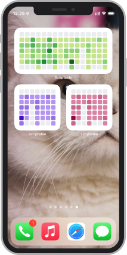

<div align="center">
  <h1>SSR-Contribution-Svg</h1>
  <a href="./README.md">English</a>
  |
  <span>简体中文</span>
  
  <h4>基于 Nest.js 的服务端渲染 GitHub 贡献墙</h4>
  <p style="color: grey;font-size: 0.9rem">
  只需要在路由 <code>参数</code> 中传入 GitHub 用户名，就可以渲染出 GitHub 贡献墙，支持自定义
  <b>输出格式</b>,
  <b>主题颜色</b>,
  <b>导出图像的质量</b>, 
  <b>统计天数</b>
  等等
  </p>
  <br />
  <span>实时渲染示例：</span>
  <br />
  
</div>

## 使用

- **为 GitHub OpenAPI 准备 PAT:**
  > https://docs.github.com/en/authentication/keeping-your-account-and-data-secure/creating-a-personal-access-token

- **在根目录下创建 `.env` 文件， 并参考 `.env.example` 填写**

- **使用以下命令安装依赖:**
  ```shell
  # npm install
  yarn install
  ```
- **运行服务:**
  ```shell
  # npm run start:dev
  yarn start:dev
  ```
- **在浏览器中查看效果**
  访问 `http://localhost:${port}/_/${username}`, 
  - `port`: `.env` 文件中的`SERVE_PORT` 变量 , 默认为 `3000`
  - `username`: Github 用户名

## 配置

<table>
  <tr>
    <th>参数名</th>
    <th>类型</th>
    <th>描述</th>
    <th>默认值</th>
  </tr>

  <tr>
    <td>theme</td>
    <td><code>enum</code></td>
    <td>
      内置主题，可用值见：
      <a href="#主题">主题</a>
    </td>
    <td><code>green</code></td>
  </tr>

  <tr>
    <td>chart</td>
    <td><code>enum</code></td>
    <td>
      图表类型, 目前只支持 <code>calendar</code>
    </td>
    <td><code>calendar</code></td>
  </tr>

  <tr>
    <td>format</td>
    <td><code>enum</code></td>
    <td>
      输出格式:
      <ul>
        <li>
          <code>html</code>
          <span>: 直接返回一个 html 页面</span>
        </li>
        <li>
          <code>svg</code>
          <span>: 返回 svg 文件</span>
        </li>
        <li>
          <code>xml</code>
          <span>: 返回 xml 格式的svg</span>
        </li>
        <li>
          <code>png</code>
          <span>: 返回 png 格式的文件(透明背景)</span>
        </li>
        <li>
          <code>jpeg</code>
          <span>: 返回 jpeg 格式的文件(白色背景)</span>
        </li>
      </ul>
    </td>
    <td><code>html</code></td>
  </tr>

  <tr>
    <td>quality</td>
    <td><code>number</code></td>
    <td>
      图像质量，取值范围为 <code>0.1</code> 到 <code>10</code>.
      <b>
        仅当导出格式（<code>format</code>）为
        <code>png</code> or <code>jpeg</code>
        时有效
      <b>
    </td>
    <td><code>1</code></td>
  </tr>

  <tr>
    <td>widget_size</td>
    <td><code>enum</code></td>
    <td>
     通过指定这一属性，自动计算周的数量 和 最佳的 ios 小组件，可用值为：
      <ul>
        <li><code>small</code></li>
        <li><code>midiun</code></li>
        <li><code>large</code></li>
      </ul>
    </td>
    <td><code>midium</code></td>
  </tr>

  <tr>
    <td>weeks</td>
    <td><code>number</code></td>
    <td>
      强制指定周数，取值范围在
      <code>1</code> 到 <code>50</code>.
      <b>会覆盖 <code>widget_size</code> 计算的 <code>周数</code> </b>
    </td>
    <td><code>undefined</code></td>
  </tr>

  <tr>
    <td>colors</td>
    <td><code>string | string[]</code></td>
    <td>
      通过 <code>,</code> 拼接Hex 格式的颜色值 (需要去除 <code>#</code> 前缀) 
      <br />
      <span>或者使用多个 <code>colors</code>变量</span>
      <br />
      <span>例如：</span>
      <br />
      <ul>
        <li>
          <span><code>colors=f00,0f0,00f,0ff,f0f,ff0</code></span>
        </li>
        <li>
          <span>
          <code>colors=f00&colors=0f0&colors=00f&colors=0ff&colors=f0f&colors=ff0</code>
          </span>
        </li>
      </ul>
      <b>
        这将会覆盖
        <code>theme</code> 属性
      </b>
    </td>
    <td><code>undefined</code></td>
  </tr>
</table>

## 主题

所有可用主题（实时更新）:


## 使用场景

- 贴到 Notion 的页面中
  

- 作为 ios 小组件使用 [Scritable](https://apps.apple.com/cn/app/scriptable/id1405459188), code example:
  ```js
    let url = "https://ssr-contributions-svg.vercel.app/_/CatsJuice?format=png&quality=2&theme=red&widget_size=midium"

    let w = await createWidget();
    Script.setWidget(w);

    async function createWidget() {
      let w = new ListWidget();
      let random = (Math.random()*100000000).toFixed(0);
      let data = await new Request(url + "&random=" + random).load();
      let image = Image.fromData(data);
      w.backgroundImage = image;
      return w;
    }
  ```

  添加 scriptable 小组件到桌面，并在组件设置中选择对应的脚本

  <br />

  