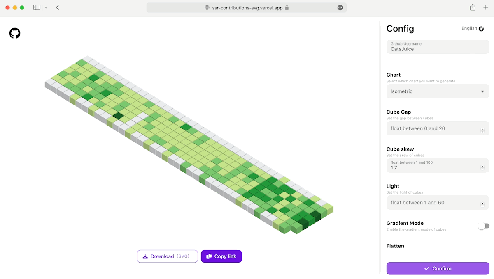

<div align="center">
  <h1>SSR-Contribution-Svg</h1>
  <span>English</span>
  |
  <a href="./README-CN.md">简体中文</a>
  
  <h4>A Nest.js API to render GitHub user's contributions to chart</h4>
  <p style="color: grey;font-size: 0.9rem">
  Just pass GitHub username in route <code>param</code>, you will get the contribution wall render by svg. Support custom
  <b>output format</b>,
  <b>color</b>,
  <b>quality</b>, 
  <b>size</b>
  and so on
  </p>
  <br />
  <span>Real-time rendering example：</span>
  <br />
  <picture>
    <source media="(prefers-color-scheme: dark)" srcset="https://ssr-contributions-svg.vercel.app/_/CatsJuice?format=svg&weeks=50&dark=true">
    <source media="(prefers-color-scheme: light)" srcset="https://ssr-contributions-svg.vercel.app/_/CatsJuice?format=svg&weeks=50">
    
  </picture>
</div>

## Playground

Now you can config and preview your contribution wall in the [Playground](https://ssr-contributions-svg.vercel.app/)

<div align="center">
  
</div>


## Run locally

- **prepare your github pat for Github OpenAPI:**
  > https://docs.github.com/en/authentication/keeping-your-account-and-data-secure/creating-a-personal-access-token

- **create a `.env` file in the root of project, Fill it with reference `.env.example`**

- **install packages with:**
  ```shell
  # npm install
  yarn install
  ```
- **run server:**
  ```shell
  # npm run start:dev
  yarn start:dev
  ```
- **try it out**
  visit `http://localhost:${port}/_/${username}`, 
  - `port`: `SERVE_PORT` variable in your `.env`, default is `3000`
  - `username`: Github username

## Configuration

```
${host}/_/${username}?${queryString}
```

- `username`: Github username
- `queryString`

**Common parameters:**
<table>
  <tr>
    <th>param</th>
    <th>type</th>
    <th>desc</th>
    <th>default</th>
  </tr>

  <tr>
    <td>theme</td>
    <td><code>enum</code></td>
    <td>
      Preset themes, avaiable values:
      <code>random</code>(use random theme) or 
      <a href="#themes">Theme Enums</a>
    </td>
    <td><code>green</code></td>
  </tr>

  <tr>
    <td>chart</td>
    <td><code>enum</code></td>
    <td>
      Chart type, See <a href="#charts">Charts</a>
    </td>
    <td><code>calendar</code></td>
  </tr>

  <tr>
    <td>format</td>
    <td><code>enum</code></td>
    <td>
      Output formats:
      <ul>
        <li>
          <code>html</code>
          <span>: return a html page</span>
        </li>
        <li>
          <code>svg</code>
          <span>: return an svg file</span>
        </li>
        <li>
          <code>xml</code>
          <span>: return an svg as xml</span>
        </li>
        <li>
          <code>png</code>
          <span>: return a png file(transparent background)</span>
        </li>
        <li>
          <code>jpeg</code>
          <span>: return a jpg file(white background)</span>
        </li>
      </ul>
    </td>
    <td><code>html</code></td>
  </tr>

  <tr>
    <td>quality</td>
    <td><code>number</code></td>
    <td>
      Image quality, supports numbers from <code>0.1</code> to <code>10</code>.
      <b>
        Only works when format is
        <code>png</code> or <code>jpeg</code>
      <b>
    </td>
    <td><code>1</code></td>
  </tr>

  <tr>
    <td>widget_size</td>
    <td><code>enum</code></td>
    <td>
      Automatically calculate the number of weeks and size needed for the ios widget by specifying this property, avaiable values:
      <ul>
        <li><code>small</code></li>
        <li><code>midium</code></li>
        <li><code>large</code></li>
      </ul>
    </td>
    <td><code>midium</code></td>
  </tr>

  <tr>
    <td>weeks</td>
    <td><code>number</code></td>
    <td>
      Force specifying how many weeks to render, allow numbers from
      <code>1</code> to <code>50</code>.
      <b>This will override <code>weeks</code> calculated by <code>widget_size</code></b>
    </td>
    <td><code>undefined</code></td>
  </tr>

  <tr>
    <td>colors</td>
    <td><code>string | string[]</code></td>
    <td>
      Hex colors value (without <code>#</code> prefix) join with 
      <code>,</code>.
      <br />
      <span>Or multiple colors.</span>
      <br />
      <span>e.g.</span>
      <br />
      <ul>
        <li>
          <span><code>colors=f00,0f0,00f,0ff,f0f,ff0</code></span>
        </li>
        <li>
          <span>
          <code>colors=f00&colors=0f0</code>
          </span>
        </li>
      </ul>
      <b>
        This will override 
        <code>theme</code> property
      </b>
    </td>
    <td><code>undefined</code></td>
  </tr>

  <tr>
    <td>dark</td>
    <td><code>boolean</code></td>
    <td>
      Enable dark-mode, See
      <a href="#darkmode">DarkMode</a>
    </td>
    <td>
      <code>false</code>
    </td>
  </tr>

</table>

**3DBar chart parameters:**

<table>
  <tr>
    <th>param</th>
    <th>type</th>
    <th>desc</th>
    <th>default</th>
  </tr>

  <tr>
    <td>gap</td>
    <td><code>number</code></td>
    <td>
    Gap size between cubes, allowed numbers from <code>0</code> to <code>20</code>
    </td>
    <td>
      <code>1.2</code>
    </td>
  </tr>

  <tr>
    <td>scale</td>
    <td><code>number</code></td>
    <td>
      Adjust vertical top view, allowed numbers not less than <code>1</code>
    </td>
    <td><code>2</code></td>
  </tr>

  <tr>
    <td>light</td>
    <td><code>number</code></td>
    <td>
      Adjust light intensity, allowed numbers from <code>1</code>
      to <code>60</code>
    </td>
    <td><code>10</code></td>
  </tr>

  <tr>
    <td>gradient</td>
    <td><code>boolean</code></td>
    <td>
      Use gradient mode to cube
    </td>
    <td><code>false</code></td>
  </tr>

  <tr>
    <td>flatten</td>
    <td><code>number</code></td>
    <td>
      Enable flatten-mode, 2 styles are avaiable:
      <br>
      <code>1</code>: flatten all blocks
      <br>
      <code>2</code>: ignore empty blocks
      <br>
      See <a href="#flatten-mode">flatten-mode examples</a>
    </td>
    <td>
      <code>0</code>
    </td>
  </tr>


  <tr>
    <td>animation</td>
    <td><code>enum</code></td>
    <td>Enable animation, See <a href="#3dbar-animation">3dbar Animation</a></td>
    <td><code>undefined</td></td>
  </tr>

</table>

## 3dbar Animation

Enable animation by passing <code>animation</code> property, available values:

- `fall` (apper only)
  ```
  chart=3dbar&weeks=20&flatten=1&animation=fall
  ```
  
  <picture>
    <source media="(prefers-color-scheme: dark)" srcset="https://ssr-contributions-svg.vercel.app/_/Catsjuice?chart=3dbar&weeks=20&flatten=1&animation=fall&format=svg&dark=true">
    <source media="(prefers-color-scheme: light)" srcset="https://ssr-contributions-svg.vercel.app/_/Catsjuice?chart=3dbar&weeks=20&flatten=1&animation=fall&format=svg">
    
  </picture>
- `raise` (apper only)
  ```
  chart=3dbar&weeks=20&flatten=1&animation=raise
  ```

  <picture>
    <source media="(prefers-color-scheme: dark)" srcset="https://ssr-contributions-svg.vercel.app/_/Catsjuice?chart=3dbar&weeks=20&flatten=1&animation=raise&format=svg&dark=true">
    <source media="(prefers-color-scheme: light)" srcset="https://ssr-contributions-svg.vercel.app/_/Catsjuice?chart=3dbar&weeks=20&flatten=1&animation=raise&format=svg">
    
  </picture>
- `wave` (loop)
  ```
  chart=3dbar&weeks=20&flatten=1&animation=wave
  ```

  <picture>
    <source media="(prefers-color-scheme: dark)" srcset="https://ssr-contributions-svg.vercel.app/_/Catsjuice?chart=3dbar&weeks=20&flatten=1&animation=wave&format=svg&dark=true">
    <source media="(prefers-color-scheme: light)" srcset="https://ssr-contributions-svg.vercel.app/_/Catsjuice?chart=3dbar&weeks=20&flatten=1&animation=wave&format=svg">
    
  </picture>

**Custome animation details**: (pass as url query parameters)

<details>
  <summary>
    <code>fall</code> | <code>raise</code>
  </summary>
  <ul>
    <li>
      <code>animation_duration</code>
      <code>&lt;Number&gt;</code>
      Animation duration in seconds.
    </li>
    <li>
      <code>animation_delay</code>
      <code>&lt;Number&gt;</code>
      Animation delay in seconds.
    </li>
  </ul>
</details>

<details>
  <summary>
    <code>wave</code></code>
  </summary>
  <ul>
    <li>
      <code>animation_amplitude</code>
      <code>&lt;Number&gt;</code>
      <br>
      The extent of the square's movement in pixel(px).
    </li>
    <li>
      <code>animation_frequency</code>
      <code>&lt;Number&gt;</code>
      <br>
      Frequency of movement of the square, between <code>[0.01, 0.5]</code>,
    </li>
    <li>
      <code>animation_wave_center</code>
      <code>&lt;Number&gt;_&lt;Number&gt;</code>
      <br>
      The center of the wave, pass coordinate points <code>x</code>, <code>y</code> as <code>${x}_${y}</code>(Join x, y with <code>_</code>) for example <code>0_0</code>.
    </li>
  </ul>
</details>


## DarkMode

In fact, the display of the chart is determined by the `theme`, which is overridden by the `color` property. Enabling dark mode here affects **the display of the built-in theme** and the **background color** when outputting `jpeg` or `html`, while the background is `transparent` in all other output formats. For more details, see [Themes](#themes)

## Charts

- **calendar**
  - use: `chart=calendar`
  - e.g.
    ```
    https://ssr-contributions-svg.vercel.app/_/CatsJuice?chart=calendar&format=svg
    ```
  
    <picture>
      <source media="(prefers-color-scheme: dark)" srcset="https://ssr-contributions-svg.vercel.app/_/CatsJuice?chart=calendar&format=svg&dark=true">
      <source media="(prefers-color-scheme: light)" srcset="https://ssr-contributions-svg.vercel.app/_/CatsJuice?chart=calendar&format=svg&dark=false">
      
    </picture>
  
- **3dbar**
  - use: `chart=3dbar`
  - e.g.
  
    ```
    https://ssr-contributions-svg.vercel.app/_/CatsJuice?chart=3dbar&format=svg
    ```
  
    <picture>
      <source media="(prefers-color-scheme: dark)" srcset="https://ssr-contributions-svg.vercel.app/_/CatsJuice?chart=3dbar&format=svg&dark=true">
      <source media="(prefers-color-scheme: light)" srcset="https://ssr-contributions-svg.vercel.app/_/CatsJuice?chart=3dbar&format=svg">
      
    </picture>

## Themes

All avaiable themes(live update):

- `light`    
  
  
- `dark`  
  

## Examples

### pin to notion
  
  

### Use as ios widget with [Scritable](https://apps.apple.com/us/app/scriptable/id1405459188)

**code example:**

```js
let [chart, widgetSize, theme, weeks] = (args.widgetParameter || "")
  .split(",")
  .map((v) => v.trim());
chart = chart || "calendar";
widgetSize = widgetSize || "midium";
theme = theme || "green";
const darkMode = Device.isUsingDarkAppearance();
let url = `https://ssr-contributions-svg.vercel.app/_/CatsJuice?format=jpeg&quality=2&theme=${theme}&widget_size=${widgetSize}&chart=${chart}&dark=${darkMode}`;

if (weeks) url += `&weeks=${weeks}`;

let w = await createWidget();
Script.setWidget(w);

async function createWidget() {
  let w = new ListWidget();
  let random = (Math.random() * 100000000).toFixed(0);
  let data = await new Request(url + "&random=" + random).load();
  let image = Image.fromData(data);
  w.backgroundImage = image;
  return w;
}
```

Add scritable widget to home screen, and select script in widget configuration.

**Note:**
The above script relies on the input of the `parameter` parameter, filling in `chart`, `widgetSize`, `theme`, `weeks` in order using the `,` division. here are some examples:

- `3dbar,large,,30`
  
  ```
  chart=3dbar&widgetSize=large&weeks=30
  ```
- `3dbar,,yellow_wine,20`
  
  ```
  chart=3dbar&theme=yellow_wine&weeks=20
  ```
- `,,blue`
  
  ```
  theme=blue
  ```
- `,small,purple`
  
  ```
  widgetSize=small&theme=purple
  ```

<br />
<div align="center">
  
</div>

### flatten-mode

- `flatten=1&format=svg`
  
  <picture>
    <source media="(prefers-color-scheme: dark)" srcset="https://ssr-contributions-svg.vercel.app/_/CatsJuice?chart=3dbar&flatten=1&format=svg&dark=true&theme=native">
    <source media="(prefers-color-scheme: light)" srcset="https://ssr-contributions-svg.vercel.app/_/CatsJuice?chart=3dbar&flatten=1&format=svg&dark=false&theme=native">
    
  </picture>


- `flatten=2&format=svg`
  
  <picture>
    <source media="(prefers-color-scheme: dark)" srcset="https://ssr-contributions-svg.vercel.app/_/CatsJuice?chart=3dbar&flatten=2&format=svg&dark=true&theme=native">
    <source media="(prefers-color-scheme: light)" srcset="https://ssr-contributions-svg.vercel.app/_/CatsJuice?chart=3dbar&flatten=2&format=svg&dark=false&theme=native">
    
  </picture>