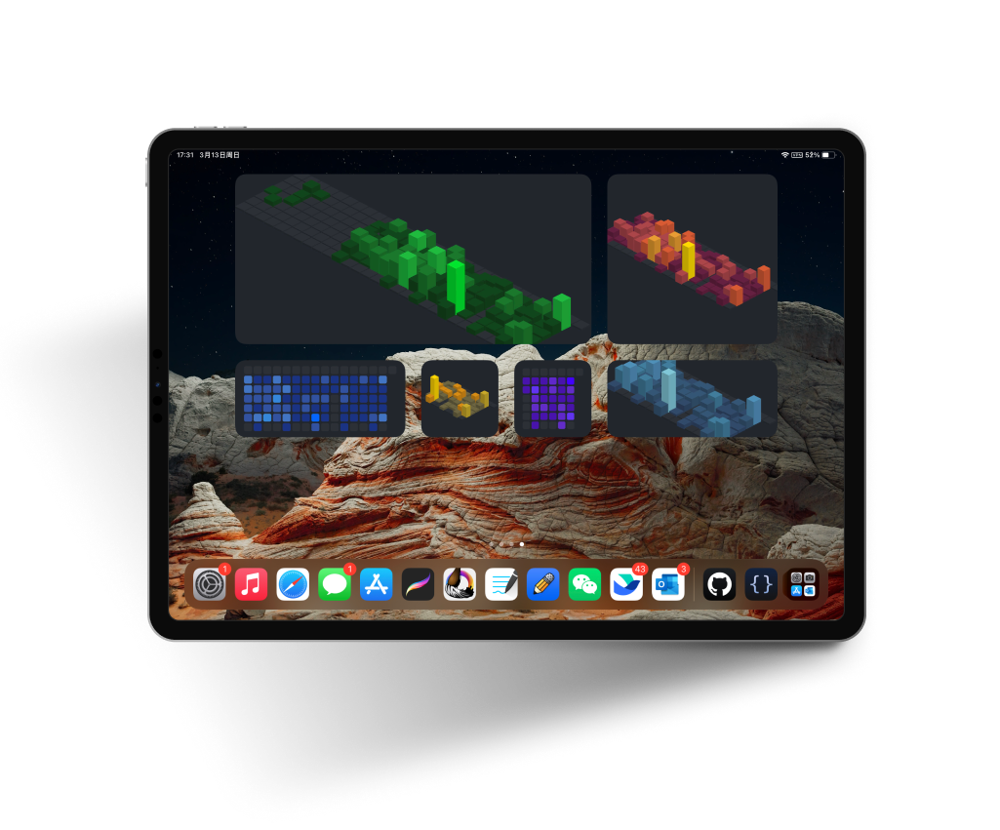

<div align="center">
  <h1>SSR-Contribution-Svg</h1>
  <span>English</span>
  |
  <a href="./README-CN.md">简体中文</a>
  
  <h4>A Nest.js API to render GitHub user's contributions to chart</h4>
  <p style="color: grey;font-size: 0.9rem">
  Just pass GitHub username in route <code>param</code>, you will get the contribution wall render by svg. Support custom
  <b>output format</b>,
  <b>color</b>,
  <b>quality</b>, 
  <b>size</b>
  and so on
  </p>
  <br />
  <span>Real-time rendering example：</span>
  <br />
  
</div>

## Usage

- **prepare your github pat for Github OpenAPI:**
  > https://docs.github.com/en/authentication/keeping-your-account-and-data-secure/creating-a-personal-access-token

- **create a `.env` file in the root of project, Fill it with reference `.env.example`**

- **install packages with:**
  ```shell
  # npm install
  yarn install
  ```
- **run server:**
  ```shell
  # npm run start:dev
  yarn start:dev
  ```
- **try it out**
  visit `http://localhost:${port}/_/${username}`, 
  - `port`: `SERVE_PORT` variable in your `.env`, default is `3000`
  - `username`: Github username

## Configuration

<table>
  <tr>
    <th>param</th>
    <th>type</th>
    <th>desc</th>
    <th>default</th>
  </tr>

  <tr>
    <td>theme</td>
    <td><code>enum</code></td>
    <td>
      Preset themes, avaiable values:
      See <a href="#themes">Themes</a>
    </td>
    <td><code>green</code></td>
  </tr>

  <tr>
    <td>chart</td>
    <td><code>enum</code></td>
    <td>
      Chart type, only <code>calendar</code> supported yet
    </td>
    <td><code>calendar</code></td>
  </tr>

  <tr>
    <td>format</td>
    <td><code>enum</code></td>
    <td>
      Output formats:
      <ul>
        <li>
          <code>html</code>
          <span>: return a html page</span>
        </li>
        <li>
          <code>svg</code>
          <span>: return an svg file</span>
        </li>
        <li>
          <code>xml</code>
          <span>: return an svg as xml</span>
        </li>
        <li>
          <code>png</code>
          <span>: return a png file(transparent background)</span>
        </li>
        <li>
          <code>jpeg</code>
          <span>: return a jpg file(white background)</span>
        </li>
      </ul>
    </td>
    <td><code>html</code></td>
  </tr>

  <tr>
    <td>quality</td>
    <td><code>number</code></td>
    <td>
      Image quality, supports numbers from <code>0.1</code> to <code>10</code>.
      <b>
        Only works when format is
        <code>png</code> or <code>jpeg</code>
      <b>
    </td>
    <td><code>1</code></td>
  </tr>

  <tr>
    <td>widget_size</td>
    <td><code>enum</code></td>
    <td>
      Automatically calculate the number of weeks and size needed for the ios widget by specifying this property, avaiable values:
      <ul>
        <li><code>small</code></li>
        <li><code>midiun</code></li>
        <li><code>large</code></li>
      </ul>
    </td>
    <td><code>midium</code></td>
  </tr>

  <tr>
    <td>weeks</td>
    <td><code>number</code></td>
    <td>
      Force specifying how many weeks to render, allow numbers from
      <code>1</code> to <code>50</code>.
      <b>This will override <code>weeks</code> calculated by <code>widget_size</code></b>
    </td>
    <td><code>undefined</code></td>
  </tr>

  <tr>
    <td>colors</td>
    <td><code>string | string[]</code></td>
    <td>
      Hex colors value (without <code>#</code> prefix) join with 
      <code>,</code>.
      <br />
      <span>Or multiple colors.</span>
      <br />
      <span>e.g.</span>
      <br />
      <ul>
        <li>
          <span><code>colors=f00,0f0,00f,0ff,f0f,ff0</code></span>
        </li>
        <li>
          <span>
          <code>colors=f00&colors=0f0&colors=00f&colors=0ff&colors=f0f&colors=ff0</code>
          </span>
        </li>
      </ul>
      <b>
        This will override 
        <code>theme</code> property
      </b>
    </td>
    <td><code>undefined</code></td>
  </tr>
</table>

## Themes

All avaiable themes(live update):


## Example

- pin to notion
  

- Use as ios widget with [Scritable](https://apps.apple.com/us/app/scriptable/id1405459188), code example:
  ```js
    let url = "https://ssr-contributions-svg.vercel.app/_/CatsJuice?format=png&quality=2&theme=red&widget_size=midium"

    let w = await createWidget();
    Script.setWidget(w);

    async function createWidget() {
      let w = new ListWidget();
      let random = (Math.random()*100000000).toFixed(0);
      let data = await new Request(url + "&random=" + random).load();
      let image = Image.fromData(data);
      w.backgroundImage = image;
      return w;
    }
  ```

  Add scritable widget to home screen, and select script in widget configuration.
  <br />

  